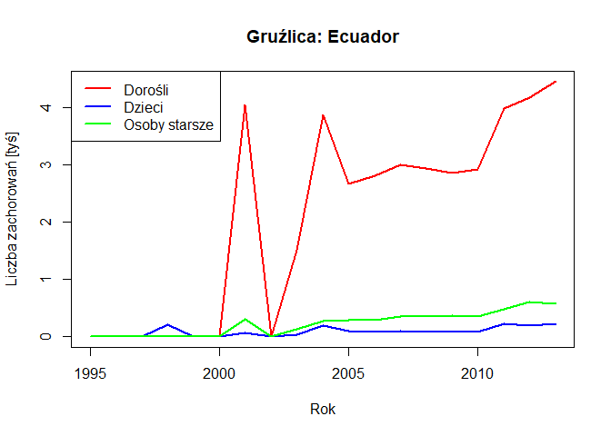
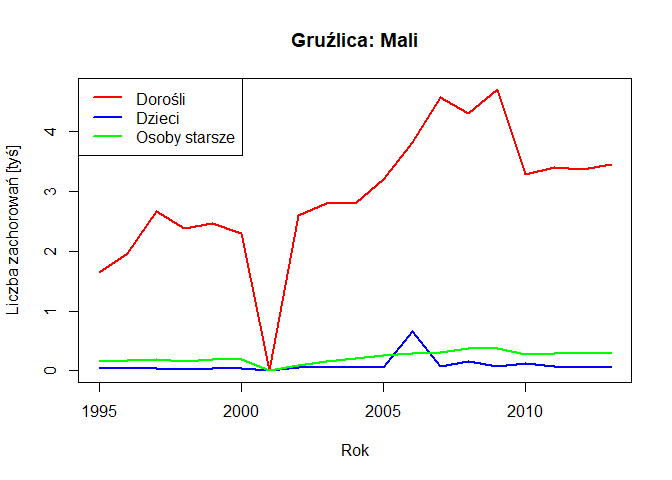

## Biblioteki
Do przygotowania raportu wykorzystano biblioteki:

- EDAWR
- dplyr


## Wczytanie danych

``` r
tib_tb <- tibble::as_tibble(tb)
```

## Krótkie podsumowanie

``` r
head(tib_tb)
```

```
## # A tibble: 6 × 6
##   country      year sex    child adult elderly
##   <chr>       <int> <chr>  <int> <int>   <int>
## 1 Afghanistan  1995 female    NA    NA      NA
## 2 Afghanistan  1995 male      NA    NA      NA
## 3 Afghanistan  1996 female    NA    NA      NA
## 4 Afghanistan  1996 male      NA    NA      NA
## 5 Afghanistan  1997 female     5    96       1
## 6 Afghanistan  1997 male       0    26       0
```

``` r
str(tib_tb)
```

```
## tibble [3,800 × 6] (S3: tbl_df/tbl/data.frame)
##  $ country: chr [1:3800] "Afghanistan" "Afghanistan" "Afghanistan" "Afghanistan" ...
##  $ year   : int [1:3800] 1995 1995 1996 1996 1997 1997 1998 1998 1999 1999 ...
##  $ sex    : chr [1:3800] "female" "male" "female" "male" ...
##  $ child  : int [1:3800] NA NA NA NA 5 0 45 30 25 8 ...
##  $ adult  : int [1:3800] NA NA NA NA 96 26 1142 500 484 212 ...
##  $ elderly: int [1:3800] NA NA NA NA 1 0 20 41 8 8 ...
```

``` r
summary(tib_tb)
```

```
##    country               year          sex                child        
##  Length:3800        Min.   :1995   Length:3800        Min.   :    0.0  
##  Class :character   1st Qu.:1999   Class :character   1st Qu.:   25.0  
##  Mode  :character   Median :2004   Mode  :character   Median :   76.0  
##                     Mean   :2004                      Mean   :  493.2  
##                     3rd Qu.:2009                      3rd Qu.:  264.5  
##                     Max.   :2013                      Max.   :25661.0  
##                                                       NA's   :396      
##      adult           elderly        
##  Min.   :     0   Min.   :     0.0  
##  1st Qu.:  1128   1st Qu.:    84.5  
##  Median :  2589   Median :   230.0  
##  Mean   : 10864   Mean   :  1253.0  
##  3rd Qu.:  6706   3rd Qu.:   640.0  
##  Max.   :731540   Max.   :125991.0  
##  NA's   :413      NA's   :413
```
Wykorzystany zbiór danych zawiera informacje o zachorowaniach na gruźlicę w różnych krajach w latach 1995-2013.
W zbiorze jest 3800 wierszy i 6 kolumn. Kolumny to:

- country - kraj
- year - rok
- sex - płeć
- child - liczba zachorowań u dzieci
- adult - liczba zachorowań u dorosłych
- elderly - liczba zachorowań u osób starszych

## Liczba zachorowań z podziałem na płeć

```
## # A tibble: 2 × 2
##   sex       cases
##   <chr>     <int>
## 1 female 15610599
## 2 male   27016456
```

<!-- -->

Z powyższego wykresu wynika, że liczba zachorowań u mężczyzn (około 27 mln) jest większa niż u kobiet (około 16 mln).

## Liczba zachorowań w kolejnych latach z podziałem na grupy wiekowe
<!-- -->

Z powyższego wykresu wynika, że liczba zachorowań u dorosłych jest największa, a liczba zachorowań u dzieci jest najmniejsza. W latach 2005-2009 liczba zachorowań u dorosłych gwałtownie wzrosła, a ostatnim roku (2012-2013) zaczęła spadać.

## Liczba zachorowań w kolejnych latach z podziałem na kraje i grupy wiekowe
<!-- --><!-- --><!-- --><!-- --><!-- --><!-- --><!-- --><!-- --><!-- --><!-- --><!-- --><!-- --><!-- --><!-- --><!-- --><!-- --><!-- --><!-- --><!-- --><!-- --><!-- --><!-- --><!-- --><!-- --><!-- --><!-- --><!-- --><!-- --><!-- --><!-- --><!-- --><!-- --><!-- --><!-- --><!-- --><!-- --><!-- --><!-- --><!-- --><!-- --><!-- --><!-- --><!-- --><!-- --><!-- --><!-- --><!-- --><!-- --><!-- --><!-- --><!-- --><!-- --><!-- --><!-- --><!-- --><!-- --><!-- --><!-- --><!-- --><!-- --><!-- --><!-- --><!-- --><!-- --><!-- --><!-- --><!-- --><!-- --><!-- --><!-- --><!-- --><!-- --><!-- --><!-- --><!-- --><!-- --><!-- --><!-- --><!-- --><!-- --><!-- --><!-- --><!-- --><!-- --><!-- --><!-- --><!-- --><!-- --><!-- --><!-- --><!-- --><!-- --><!-- --><!-- --><!-- --><!-- --><!-- --><!-- --><!-- --><!-- -->
